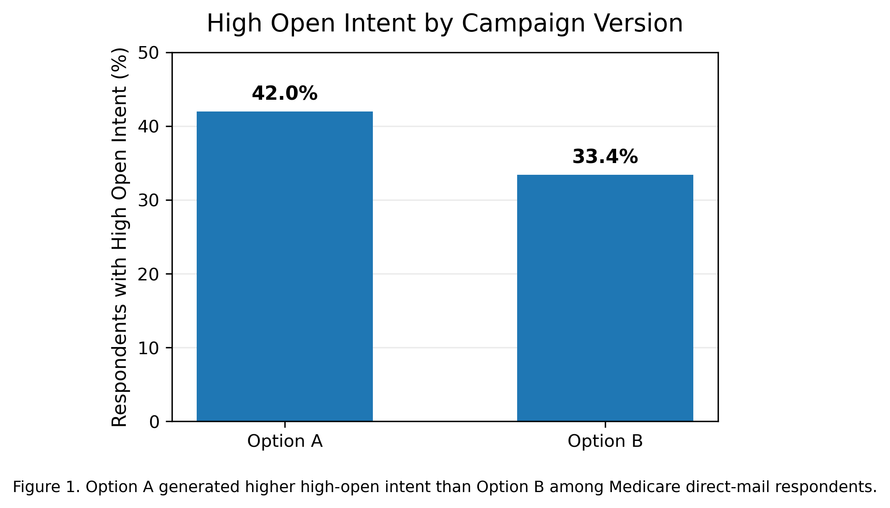

# Customer Engagement Experiment for Direct-Mail Campaigns

A marketing analytics project evaluating two direct-mail campaign concepts for **MVP Health Care** using A/B experiment data. The analysis identifies which campaign better captures customer attention and provides actionable recommendations to improve future marketing performance.

> **Note:** This repository is adapted from a graduate consulting-style team project. The analysis and documentation focus on my individual analytical contributions.

<div align="center">

</div>

---

## Business Problem

MVP Health Care wanted to identify which direct-mail campaign concept would generate stronger customer engagement before launching a large-scale Medicare marketing campaign.

Using data from a randomized A/B experiment involving approximately 1,000 respondents, this project evaluates campaign effectiveness through statistical hypothesis testing and translates analytical findings into actionable marketing recommendations.

---

## Experiment Design

- **Sample Size:** 1,000 respondents
- **Treatment Groups:** 500 respondents per campaign
- **Experiment Type:** Randomized A/B experiment
- **Primary Metrics**
  - Likelihood to Open
  - Likelihood to Take Next Step
- **Statistical Methods**
  - Independent-sample t-test
  - Two-proportion z-test

---

## My Contributions

**Analytics**

- Cleaned and validated survey responses
- Conducted independent-sample t-tests and proportion z-tests
- Built Python visualizations for customer engagement metrics

**Business**

- Interpreted experimental findings
- Developed marketing recommendations
- Presented analytical insights to client stakeholders

---

## Key Findings

### Higher Mail-Open Intent

Option A significantly outperformed Option B in attracting customer attention.

| Metric | Option A | Option B |
|---------|----------|----------|
| High Open Intent | **42.0%** | 33.4% |
| Difference | **+8.6 percentage points** | |

<div align="center">

</div>

---

### Statistical Results

| Metric | Result |
|---------|--------|
| Mean Open-Intent Score | 3.03 vs. 2.75 |
| t-test | p = 0.002 |
| High Response Rate (4–5) | 42.0% vs. 33.4% |
| z-test | p = 0.005 |

Both statistical tests indicate that **Option A generated significantly stronger initial customer engagement.**

---

### Funnel Insight

Although Option A attracted significantly more attention, both campaigns produced nearly identical willingness to take the next step after reading the mail.

This suggests that the primary opportunity lies in improving:

- Message clarity
- Benefit communication
- Call-to-action (CTA)

rather than redesigning the overall campaign concept.

---

## Business Recommendations

Based on the analysis, we recommended adopting **Option A** while improving conversion-oriented elements inside the mail piece.

Suggested improvements included:

- Strengthen benefit hierarchy
- Simplify customer messaging
- Make the CTA more specific and action-oriented
- Tailor messaging for different demographic segments

---

## Tech Stack

- Python
- pandas
- NumPy
- SciPy
- Matplotlib
- Statistical Testing
- A/B Experimentation

---

## Repository Structure

```
├── data/
├── images/
├── notebook/
├── README.md
```
